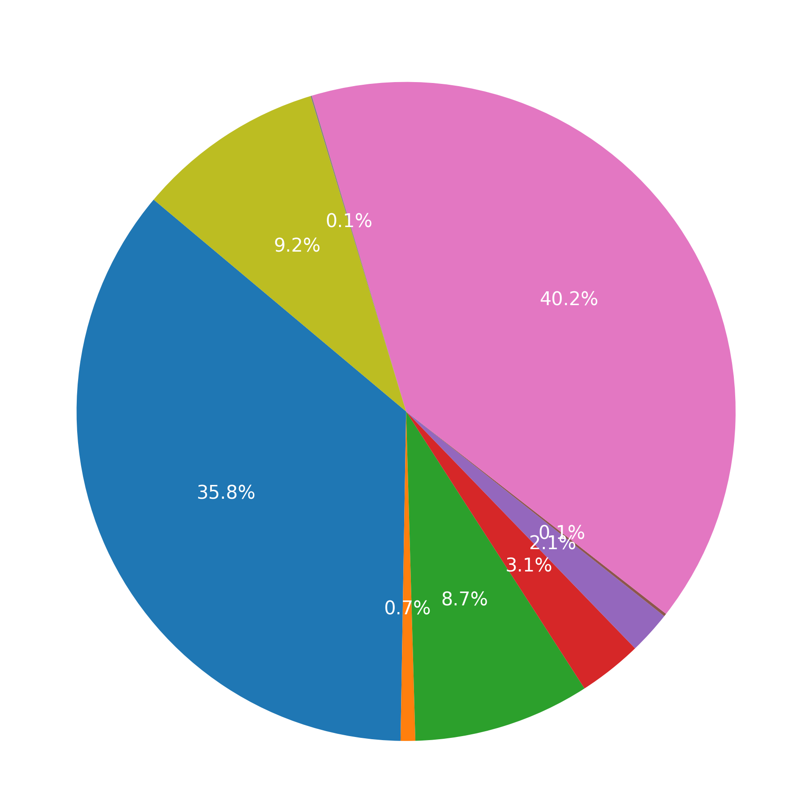
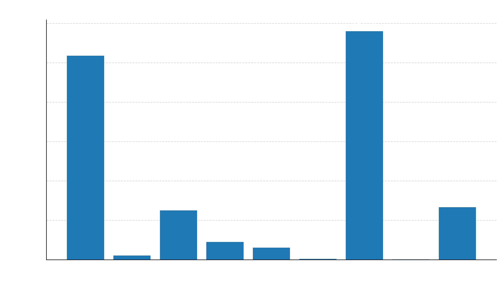

# Derek R. Neilson

**Computer Science Professional · System Administration · Software Engineering · AI Enthusiast**

---

## 🌱 Learning & Growth

* Advanced **Rust** GUI development (GTK ecosystem and tooling).
* Optimizing ML models for on‑the‑fly document classification.
* Modern **DevOps** practices: Docker, CI/CD pipelines, GitHub Actions.

---

## 👯 Collaboration Interests

* **Cybersecurity** & secure infrastructure projects.
* **Natural Language Processing** & AI‑driven tools.
* Productivity enhancers and automation solutions.

---

## 🧭 Summary

I am a computer science professional focused on building reliable, maintainable systems—ranging from web applications and CLI tooling to containerized services deployed on Linux. My work emphasizes clarity, security, and reproducibility. I value minimalism in design and rigorous engineering practices in implementation.

---

## My Software Development Lifecycle

```mermaid
%% Software Development Lifecycle Iterative
%% Switched to LR to use more horizontal space; each subgraph keeps vertical stacking (direction TB)
flowchart LR
  %% 1) Discovery & Planning
  subgraph DISCOVERY[Discovery and Planning]
    direction TB
    DP1[Problem or Opportunity]
    DP2[Stakeholder Interviews]
    DP3[Requirements Functional and Non Functional]
    DP4[Prioritized Roadmap]
    DP5[Success Metrics and SLOs]
    DP6[Risk and Assumptions Log]
    DP1 --> DP2 --> DP3 --> DP4 --> DP5 --> DP6
  end

  %% 2) Design & Architecture
  subgraph DESIGN[Design and Architecture]
    direction TB
    DA1[High Level Architecture]
    DA2[Architecture Decision Records]
    DA3[Data Model and Schema]
    DA4[API and Contracts]
    DA5[Security and Privacy Design]
    DA6{Need PoC?}
    DA7[Spike / PoC]
    DP6 --> DA1 --> DA2 --> DA3 --> DA4 --> DA5 --> DA6
    DA6 -- Yes --> DA7
    DA6 -- No  --> FEASIBLE
    DA7 --> FEASIBLE
  end

  FEASIBLE{Feasible within constraints}
  FEASIBLE -- No --> DP4
  FEASIBLE -- Yes --> IMPL1

  %% 3) Implementation (Iterative)
  subgraph IMPLEMENT[Implementation Iterative]
    direction TB
    IMPL1[Backlog Refinement]
    IMPL2[Sprint Planning]
  IMPL3[[Branch feature]]
    IMPL4[Lightweight Design Review]
  IMPL5[Implement Code and Tests]
  IMPL6[Local Quality Checks]
    IMPL7[[Open Pull Request]]
    IMPL8[Peer Code Review]
    IMPL9[[Merge to main]]
    IMPL1 --> IMPL2 --> IMPL3 --> IMPL4 --> IMPL5 --> IMPL6 --> IMPL7 --> IMPL8
    REVIEW{Approved?}
    IMPL8 --> REVIEW
    REVIEW -- No  --> IMPL5
    REVIEW -- Yes --> IMPL9
  end

  %% 4) Continuous Integration
  subgraph CI[Continuous Integration]
    direction TB
  CI1[Build and Compile]
  CI2[Static Analysis and Lint]
    CI3[Unit Tests]
  CI4[Dependency and License Scan]
  CI5[Container Build and Scan]
    CI6[Integration Tests]
    CI7[E2E Tests]
  CI8[Package and Version Artifact]
    IMPL9 --> CI1 --> CI2 --> CI3 --> CI4 --> CI5 --> CI6 --> CI7 --> CI8
  PIPE_OK{Pipeline Green}
    CI8 --> PIPE_OK
    PIPE_OK -- No --> IMPL5
  end

  PIPE_OK -- Yes --> REL1

  %% 5) Release & Deployment
  subgraph RELEASE[Release and Deployment]
    direction TB
    REL1[Create Release Candidate]
  REL2[DB Migration and Rollback Plan]
  REL3[Deploy to Staging]
    REL4[Smoke Tests]
  REL5[Performance and Load vs SLOs]
  REL6[Security DAST Secrets SBOM]
  REL7[QA UAT Signoff]
  GATES{Staging Gates Passed}
    REL1 --> REL2 --> REL3 --> REL4 --> REL5 --> REL6 --> REL7 --> GATES
    GATES -- No --> IMPL5
    GATES -- Yes --> GO_NO_GO
  GO_NO_GO{Go or No Go}
    GO_NO_GO -- No-Go --> IMPL5
    GO_NO_GO -- Go --> REL8
  REL8[Prod Deploy Canary or Blue Green]
    REL9[Post-Deploy Verification]
  REL10[Feature Flag Gradual Rollout]
    REL8 --> REL9 --> REL10
  end

  %% 6) Operations & Feedback
  subgraph OPS[Operations and Feedback]
    direction TB
  OP1[Observability Metrics Logs Traces]
  OP2[SLO and SLA Monitoring]
    OP3{Incident?}
    OP4[Rollback]
  OP5[Incident Response and Comms]
  OP6[Postmortem Review]
  OP7[Usage Analytics Experiments]
  OP8[Docs and Release Notes]
    OP9[Backlog Updates]
    REL10 --> OP1 --> OP2 --> OP3
    OP3 -- Yes --> OP4 --> OP5 --> OP6 --> OP9
    OP3 -- No  --> OP7 --> OP8 --> OP9
    OP9 --> IMPL1
  end

```

Current selections are marked “— Chosen.” Adjust as the project evolves.

---

## 💼 Skills & Technologies

| Domain              | Tools & Languages                                        |
| ------------------- | -------------------------------------------------------- |
| **Programming**     | Rust, C++, Python, JavaScript/TypeScript                 |
| **Web Development** | React, Node.js, Flask, Vite                              |
| **DevOps & Tools**  | Docker, GitHub Actions, Traefik, NATS, Systemd, Bash/Zsh |
| **Databases**       | PostgreSQL, SQLite, InfluxDB, Supabase                   |
| **AI & ML**         | PyTorch, TensorFlow, NLP, fine‑tuning                    |
| **Systems**         | Debian Linux, virtualization (libvirt, QEMU/KVM)         |

---

## 🧱 Experience Snapshot

* **Linux system administration (Debian):** Service hardening, logging, and monitoring; reproducible deployments.
* **Containerization & orchestration:** Multi‑service Docker Compose setups; certificate management; reverse proxy configuration with Traefik.
* **Messaging & real‑time services:** Practical use of NATS for eventing and messaging.
* **CI/CD:** Build/test/release pipelines with GitHub Actions; artifact versioning and environment promotion.
* **Testing & QA:** Automated testing for web applications and libraries.

---

## 📊 GitHub Statistics

  
  

Note: The plots above are generated from local analysis scripts and reflect personal repositories.

---

## 🤝 Connect

* 📧 **Email:** [derekrneilson@gmail.com](mailto:derekrneilson@gmail.com)
* 🧪 **GitHub:** [github.com/derekneilson](https://github.com/derekneilson)

---

## ⚡ Fun Facts

* 🎯 Advocate of minimalist design: less clutter, greater focus.
* 📚 Family‑oriented; I balance rigorous work with meaningful time off.

> *“Simplicity is the ultimate sophistication.”* — Leonardo da Vinci

---

## 📌 Notes & Options (Remove before publishing)

* Add links for LinkedIn, personal site, or a publication list, if available.
* If preferred, include badges (e.g., build status, code style, license) for selected projects.
* A condensed résumé variant can be produced from this profile for LinkedIn or a personal website.
