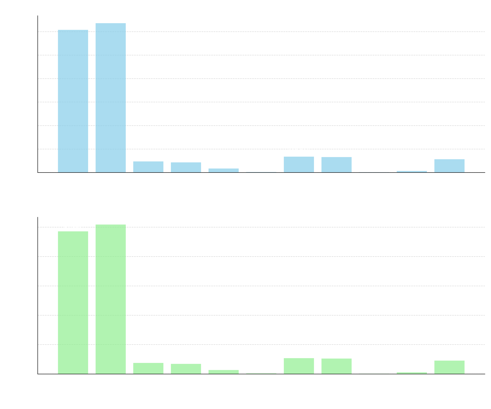

# Derek R. Neilson 👋

**Computer Science Professional • System Administration • Software Engineering • AI Enthusiast**

---

## 🔭 Current Focus

**Hebrew Transliteration Helper**
A web application for customizable Hebrew transliteration with optional niqqud (vowel marks).

---

## 🌱 Learning & Growth

* Advanced **Rust** GUI development using GTK and related ecosystems.
* Optimizing machine learning models for on-the-fly document classification.
* Modern **DevOps** practices: Docker, CI/CD pipelines, and GitHub Actions.

---

## 👯 Collaboration Interests

* **Cybersecurity** & secure infrastructure projects
* **Natural Language Processing** & AI-driven tools
* Productivity enhancers and automation solutions

---

## 🤝 Connect with Me

* 📧 [derekrneilson@gmail.com](mailto:derekrneilson@gmail.com)

---

## 📊 GitHub Statistics

  
  

---

## 💼 Skills & Technologies

| Domain              | Tools & Languages                                |
| ------------------- | ------------------------------------------------ |
| **Programming**     | Rust, C++, Python, JavaScript/TypeScript         |
| **Web Development** | Flask, Node.js, Vite, React                      |
| **DevOps & Tools**  | Docker, GitHub Actions, Systemd, Bash/Zsh        |
| **Databases**       | SQLite, InfluxDB, Supabase                       |
| **AI & ML**         | TensorFlow, PyTorch, fine-tuning, NLP            |
| **Systems**         | Debian Linux, virtualization (libvirt, QEMU/KVM) |

---

## 🚀 Notable Project

* **Hebrew Transliteration Helper**:
  A web application for customizable Hebrew transliteration with optional niqqud.
  [View on GitHub](https://github.com/derekneilson/hebrew-transliteration-helper)

---

## ⚡ Fun Facts

* 🎯 Advocate of minimalist design: less clutter, greater focus.
* 📚 Family-oriented: balancing rigorous work with quality time.

---

> *“Simplicity is the ultimate sophistication.”* – Leonardo da Vinci
